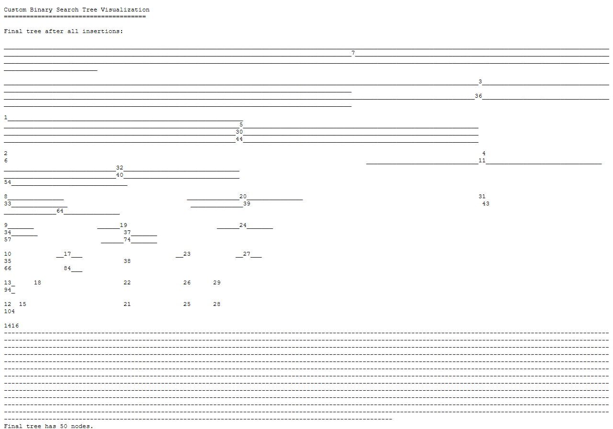

# C++ Data Structures Portfolio

[](https://isocpp.org/)
[](https://cmake.org/)
[](#projects)

Three related C++ exercises demonstrating custom data-structure implementation, pointer-based relationships, traversal, and console visualization.

## Demo



The screenshot above is output from the included binary-search-tree executable after inserting 50 nodes.

## Repository map

| Project | Primary focus |
| --- | --- |
| [Basic multilist](multilist-basic/) | Insertion, relationship management, and traversal |
| [Multidimensional multilist](multilist-dimensional/) | Cross-dimensional relationships and traversal |
| [Binary search tree](binary-search-tree/) | Ordered insertion and console visualization |

## Projects

### Basic multilist

[`multilist-basic/`](multilist-basic/) implements a custom multilist with insertion, relationship management, traversal, and formatted output. The work emphasizes explicit data-structure logic instead of relying entirely on standard-library containers.

### Multidimensional multilist

[`multilist-dimensional/`](multilist-dimensional/) extends the concept to multidimensional relationships and more complex traversal behavior.

### Binary search tree visualization

[`binary-search-tree/`](binary-search-tree/) builds a binary search tree from a predefined sequence and renders the tree in the console as nodes are inserted.

## Build

With CMake and a C++17 compiler:

```console
cmake -S . -B build
cmake --build build
```

The build produces separate executables for each exercise.

## Skills demonstrated

- C++ classes and header/source organization
- Pointer-based data structures
- Insertion and traversal algorithms
- Binary search tree construction
- Multidimensional relationships
- Console visualization and debugging

## Verification status

The binary-search-tree target was compiled and executed with the Visual Studio 2022 C++17 toolchain during the portfolio verification pass. The repository also includes a unified CMake configuration for all three exercises.

## About the author

Built by **Ahmed Balde** to demonstrate foundational C++ implementation skills beyond standard-library abstractions. See more work on [GitHub](https://github.com/fetachino).
